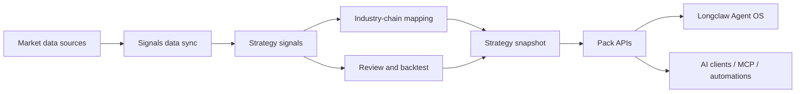

# Signals

AI-first signal and evidence layer for the trader's second screen.

中文定位：开源 AI 原生 / AI-first 金融终端的领域能力和证据生产层。

Signals is an open financial analysis pack for real-time signal production,
strategy evidence, industry-chain mapping, chart context, and backtest feedback.
It is designed to feed Longclaw Agent OS, but it can also run standalone through
CLI modes and FastAPI workbench endpoints.

This project does not try to replace Tonghuashun, Eastmoney, Futu, Bloomberg,
TradingView, or any full-market quote terminal. Those tools are the first screen.

Signals is the domain engine behind the second screen: it turns market data into
structured candidates, warnings, strategy snapshots, evidence, and AI-readable
context.

> Positioning: the domain capability and evidence production layer for an
> AI-native, AI-first financial terminal.

## What Signals Does

Signals watches the market through a strategy lens:

- syncs market data and source freshness into a usable read model
- detects index, sector, concept, and symbol-level signal changes
- maps boards, concepts, and industry chains into trader-readable themes
- identifies abnormal sector movement and quantitative pivot points
- builds `chart_context` so a workbench or agent knows what to inspect
- persists `strategy_snapshot` as the canonical strategy read model
- runs review and backtest loops to measure whether signals are useful
- exposes pack APIs consumed by Agent OS and other AI clients

The output is not another quote screen. The output is evidence an agent or trader
can reason over.

## Product Relationship

Signals and Longclaw Agent OS are intentionally split:



| Layer | Project | Responsibility |
|-------|---------|----------------|
| Workbench | `longclaw-agent-os` | Second-screen UI, observation stream, trader task flow, decision queue, and review surfaces. |
| Domain pack | `Signals` | Data sync, signal detection, industry-chain evidence, backtests, chart context, strategy snapshot, and pack APIs. |
| Market tools | External terminals | Full-market quotes, licensed depth, charting, broker workflows, and execution. |

## Why It Is Different From A Market Terminal

Traditional terminals optimize for coverage and speed. Signals optimizes for
decision context.

| Traditional terminal | Signals |
|----------------------|---------|
| Shows every quote and chart. | Produces the small set of changes that deserve review. |
| Optimized for manual scanning. | Optimized for AI explanation and automated observation. |
| Focuses on breadth of market data. | Focuses on key indices, abnormal sectors, strategy turns, and evidence. |
| Treats indicators as visual overlays. | Turns indicators, backtests, and source freshness into structured payloads. |
| Lives as the first screen. | Feeds the trader's second screen. |

## Core Modules

| Module | Path | Role |
|--------|------|------|
| Core signal engine | `signals/core/` | Chan-style structure, MA/MACD context, gaps, anomalies, scoring, and risk signals. |
| Data gateway | `signals/data/` | Unified access to MongoDB, AKShare, Futu, yfinance, Eastmoney, THS, and local caches. |
| Data sync | `signals/sync/` | Scheduled sync, source freshness, MongoDB persistence, proxy handling, and `strategy_snapshot` generation. |
| Layers | `signals/layers/` | Index, industry, concept, and symbol-level analysis. |
| Strategy snapshot | `signals/strategy/` | Canonical read model for candidates, warnings, themes, chart context, KPIs, and source confidence. |
| Domain pack | `signals/domain_pack.py` | Pack descriptor, dashboard payload, run ledger, and Agent OS contract. |
| Workbench API | `signals/web/` | FastAPI app for dashboard, chart, stock, review, backtest, workbench, pack, and strategy APIs. |
| Web2 | `signals/web2/` | Lightweight cluster and backtest surface. |
| Research and notify | `signals/research/`, `signals/notify/` | Research import, notes, and Feishu-style notifications. |

## Evidence Products

Signals produces structured artifacts rather than only text reports.

| Artifact | Why it matters |
|----------|----------------|
| `strategy_snapshot` | The canonical strategy read model for workbenches and agents. |
| `chart_context` | Tells the UI or AI client which symbol, level, overlays, and latest signal deserve inspection. |
| `decision_queue` | Converts signal changes into reviewable trader tasks. |
| `source_confidence` | Shows whether the current conclusion is backed by fresh and reliable data. |
| `strategy_kpis` | Keeps signal quality, warning count, and candidate quality visible. |
| Domain-pack runs | Writes pack-level run artifacts for Agent OS review surfaces. |

Important endpoints:

```text
GET /api/strategy/snapshot
GET /api/pack/dashboard
GET /api/pack/descriptor
GET /api/workbench/shell
GET /api/workbench/symbol/{symbol}
GET /api/backtest/health/push2his
```

## Quick Start

Signals uses Python 3.11.

```bash
git clone https://github.com/Gemini-Nick/signals.git
cd signals
bash scripts/bootstrap-dev.sh
```

Run the core modes:

```bash
bash scripts/python.sh run.py --mode index
bash scripts/python.sh run.py --mode review
bash scripts/python.sh run.py --mode backtest
bash scripts/python.sh run.py --mode web --port 8011
bash scripts/python.sh run.py --mode web2 --port 6008
```

Sync data and build the strategy snapshot:

```bash
bash scripts/python.sh -m signals.sync.engine --once
bash scripts/python.sh -m signals.sync.engine --once --module strategy_snapshot
```

Connect to Longclaw Agent OS:

```bash
# Terminal 1, in Signals
bash scripts/python.sh run.py --mode web --port 8011

# Terminal 2, in Signals
bash scripts/python.sh run.py --mode web2 --port 6008

# Terminal 3, in longclaw-agent-os
export LONGCLAW_SIGNALS_WEB_BASE_URL=http://127.0.0.1:8011
export LONGCLAW_SIGNALS_WEB2_BASE_URL=http://127.0.0.1:6008
npm run electron:start
```

## Operating Modes

| Mode | Job |
|------|-----|
| `index` | Fast read on key index structure and market regime. |
| `intraday` | Live monitoring for index, industry, concept, and symbol-level signals. |
| `review` | Post-market signal ranking, evidence capture, and archive flow. |
| `backtest` | Historical signal evaluation, forward returns, MFE/MAE, win rate, and weighting feedback. |
| `web` | Full FastAPI workbench with dashboard, chart, stock, review, backtest, workbench, pack, and strategy APIs. |
| `web2` | Lightweight cluster and MACD/backtest surface. |
| `sync` | Scheduled data sync, freshness, MongoDB persistence, and derived read models. |

## Data Sources

Signals supports a layered source strategy:

- MongoDB as the preferred local read/cache layer when available
- AKShare for A-share index, stock, sector, and concept data
- Eastmoney and Tonghuashun for board, concept, K-line, and constituents
- Futu OpenD for Hong Kong and US intraday data
- yfinance as a US-market fallback
- local SQLite, JSON, and disk caches as runtime fallbacks

Freshness and fallback behavior are part of the evidence. A signal without source
health is not treated as a complete decision surface.

## Architecture

```text
signals/
  core/          Signal engine, scoring, risk, MA/MACD, gaps, anomalies
  data/          Gateways, caches, MongoDB fallback, provider contracts
  sync/          Scheduled sync, freshness, proxy, strategy snapshot module
  layers/        Index, industry, concept, and symbol-level analysis
  strategy/      Canonical strategy snapshot and chart context
  web/           Full FastAPI workbench and pack APIs
  web2/          Lightweight cluster/backtest API
  research/      Research import and note handling
  notify/        Notification adapters
  domain_pack.py Agent OS pack contract and run ledger
```

## Documentation

- [Architecture Plan](docs/architecture-plan.md)
- [Open Source Agent Vision](docs/vision-open-source-agent.md)
- [Signal Fusion Design](docs/signal-fusion-design.md)
- [AI Reasoning Layer](docs/ai-reasoning-layer.md)
- [Trading Methodology](docs/trading-methodology-phase2.md)
- [Data Ops Issue Log](docs/signals-data-ops-issue-log.md)

## Status

Signals is a builder-facing, local-first financial research and signal pack. It is
useful when you want structured evidence, agent-readable context, and backtestable
signals rather than another grid of quotes.

Not financial advice. Signals produces research context and evidence. Trading
decisions remain the user's responsibility.

## License

No `LICENSE` file is currently included. Add an explicit open-source license before
public release or external contribution.
