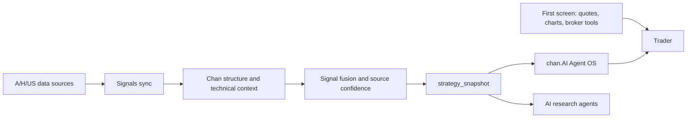

# chan.AI Signals


English | [中文](README.zh-CN.md)

Signals is the Chan-theory signal and evidence engine for **chan.AI**.

chan.AI is an AI-native trading framework for the OnePersonCompany stock trader. It is built as the trader's second screen: the first screen stays with Tonghuashun, Eastmoney, Futu, Bloomberg, TradingView, or the broker terminal; chan.AI watches the structure, detects the moments that deserve attention, and turns them into evidence a trader and an AI research agent can review.

Signals owns the market-data, signal, strategy snapshot, industry-chain, backtest, and evidence-production layer. The desktop workbench lives in `longclaw-agent-os`.

## Product Thesis

Most market terminals show more data.

Signals tries to produce fewer, better questions:

- Is the current move a structure change or only noise?
- Which level is active: index, sector, concept chain, or symbol?
- Is this a Chan-theory buy/sell point, a pivot, a divergence, or a false alarm?
- Which evidence supports the signal: price structure, volume, MA/MACD context, sector rotation, source freshness, and backtest history?
- Should the trader review this now, after the close, or ignore it?

The goal is not prediction. The goal is complete classification of the current structure, then a disciplined review loop.



## What Signals Owns

| Layer | What it does |
|-------|--------------|
| Chan structure | Level-aware structure analysis, buy/sell point detection, MA/MACD context, gaps, anomalies, and risk signals. |
| Market sync | Scheduled A-share, Hong Kong, and US data ingestion with MongoDB, AKShare, Eastmoney, Tonghuashun, Futu, yfinance, and local caches. |
| Industry chain | Board, concept, sector, and industry-chain mapping so signals are understood in context rather than as isolated tickers. |
| Strategy snapshot | A canonical read model for candidates, warnings, themes, chart context, KPIs, and source confidence. |
| Review loop | Intraday monitoring, post-market review, backtests, signal ranking, and run artifacts. |
| Pack API | FastAPI endpoints consumed by chan.AI Agent OS, MCP clients, automations, and other AI surfaces. |

## Evidence Products

Signals produces structured artifacts. Text explanations are downstream of these artifacts, not a substitute for them.

| Artifact | Why it matters |
|----------|----------------|
| `strategy_snapshot` | Canonical strategy read model for workbenches and agents. |
| `chart_context` | Tells the UI or AI client which symbol, level, overlays, and latest signal deserve inspection. |
| `decision_queue` | Converts signal changes into reviewable trader tasks. |
| `source_confidence` | Shows whether the conclusion is backed by fresh and reliable data. |
| `strategy_kpis` | Keeps candidate count, warning count, signal quality, and review pressure visible. |
| Domain-pack runs | Writes pack-level run artifacts for Agent OS review surfaces. |

Important endpoints:

```text
GET /api/strategy/snapshot
GET /api/pack/dashboard
GET /api/pack/descriptor
GET /api/workbench/shell
GET /api/workbench/symbol/{symbol}
GET /api/backtest/health/push2his
```

## Relationship To chan.AI Agent OS

Signals and `longclaw-agent-os` are intentionally split.

| Project | Role |
|---------|------|
| `Signals` | Domain capability owner. Produces signals, evidence, snapshots, backtests, source health, and pack APIs. |
| `longclaw-agent-os` | Workbench owner. Hosts the trader second screen, decision queue, observations, review surfaces, and local runtime. |
| External market terminals | First screen. Provide full-market quote coverage, broker workflows, licensed depth, and execution. |

This split matters. Signals should stay excellent at evidence production. Agent OS should stay excellent at the trader-facing workflow.

## Quick Start

Signals uses Python 3.11.

```bash
git clone https://github.com/Gemini-Nick/signals.git
cd signals
bash scripts/bootstrap-dev.sh
```

Run core modes:

```bash
bash scripts/python.sh run.py --mode index
bash scripts/python.sh run.py --mode review
bash scripts/python.sh run.py --mode backtest
bash scripts/python.sh run.py --mode web --port 8011
bash scripts/python.sh run.py --mode web2 --port 6008
```

Sync data and build the strategy snapshot:

```bash
bash scripts/python.sh -m signals.sync.engine --once
bash scripts/python.sh -m signals.sync.engine --once --module strategy_snapshot
```

Connect to chan.AI Agent OS:

```bash
# Terminal 1, in Signals
bash scripts/python.sh run.py --mode web --port 8011

# Terminal 2, in Signals
bash scripts/python.sh run.py --mode web2 --port 6008

# Terminal 3, in longclaw-agent-os
export LONGCLAW_SIGNALS_WEB_BASE_URL=http://127.0.0.1:8011
export LONGCLAW_SIGNALS_WEB2_BASE_URL=http://127.0.0.1:6008
npm run electron:start
```

The historical environment variable names still use `LONGCLAW_*` for compatibility. The product brand is now chan.AI.

## Operating Modes

| Mode | Job |
|------|-----|
| `index` | Fast read on key index structure and market regime. |
| `intraday` | Live monitoring for index, industry, concept, and symbol-level signals. |
| `review` | Post-market signal ranking, evidence capture, and archive flow. |
| `backtest` | Historical signal evaluation, forward returns, MFE/MAE, win rate, and weighting feedback. |
| `web` | Full FastAPI workbench with dashboard, chart, stock, review, backtest, workbench, pack, and strategy APIs. |
| `web2` | Lightweight cluster and MACD/backtest surface. |
| `sync` | Scheduled data sync, freshness, MongoDB persistence, and derived read models. |

## Current Market Scope

| Market | Current role | Notes |
|--------|--------------|-------|
| A-shares | Primary focus | Index, sector, concept, industry-chain, and symbol-level signal discovery. |
| Hong Kong stocks | Active extension | Futu-based and fallback data paths support cross-market review. |
| US equities | Active extension | yfinance and Futu-style paths support research and watchlist context. |
| Futures | Roadmap | Should reuse the same structure and evidence model after the stock loop is stable. |
| US options | Roadmap | Should enter through risk, Greeks, event, and options-specific evidence layers rather than simple price overlays. |

## Repository Map

```text
signals/
  core/          Signal engine, scoring, risk, MA/MACD, gaps, anomalies
  data/          Gateways, caches, MongoDB fallback, provider contracts
  sync/          Scheduled sync, freshness, proxy, strategy snapshot module
  layers/        Index, industry, concept, and symbol-level analysis
  strategy/      Canonical strategy snapshot and chart context
  web/           Full FastAPI workbench and pack APIs
  web2/          Lightweight cluster/backtest API
  research/      Research import and note handling
  notify/        Notification adapters
  domain_pack.py Agent OS pack contract and run ledger
```

## Documentation

- [Chinese README](README.zh-CN.md)
- [Signal Fusion Design](docs/signal-fusion-design.md)
- [AI Reasoning Layer](docs/ai-reasoning-layer.md)
- [Trading Methodology](docs/trading-methodology-phase2.md)
- [Open Source Agent Vision](docs/vision-open-source-agent.md)
- [Data Ops Issue Log](docs/signals-data-ops-issue-log.md)

## Safety

Signals produces research context and evidence. It does not place trades, route orders, provide investment advice, or guarantee signal profitability. Trading decisions remain the user's responsibility.

## License

No `LICENSE` file is currently included. Add an explicit open-source license before public release or external contribution.
