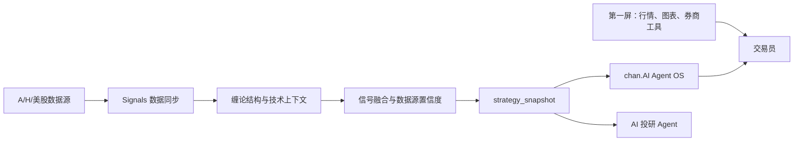

# chan.AI Signals


[English](README.md) | 中文

Signals 是 **chan.AI（缠论AI）** 的缠论信号与证据生产层。

chan.AI 是面向 OnePersonCompany 股票交易员的 AI 原生交易框架。它不是第一屏行情终端，不替代同花顺、东方财富、富途、Bloomberg、TradingView 或券商客户端。第一屏负责行情、报价、交易和全市场覆盖；chan.AI 作为第二屏，负责盯结构、找信号、生成证据，并把值得交易员处理的变化变成可审阅任务。

Signals 负责市场数据、缠论结构、行业链、策略快照、回测和证据生产。桌面工作台由 `longclaw-agent-os` 承载。

## 产品判断

传统终端提供更多数据。

Signals 要做的是提出更少但更重要的问题：

- 当前变化是结构变化，还是噪音？
- 当前级别在哪里：指数、板块、概念链，还是个股？
- 这是一买、二买、三买、卖点、中枢、背驰，还是假信号？
- 证据是否完整：价格结构、量能、均线、MACD、板块轮动、数据源新鲜度、历史回测？
- 这个信号应该盘中处理、盘后复盘，还是忽略？

目标不是预测，而是对当下结构做完整分类，再进入审阅和反馈循环。



## Signals 负责什么

| 层 | 职责 |
|----|------|
| 缠论结构 | 按级别识别结构、买卖点、均线/MACD 上下文、缺口、异常和风险信号。 |
| 市场同步 | A股、港股、美股数据同步，覆盖 MongoDB、AKShare、东方财富、同花顺、富途、yfinance 和本地缓存。 |
| 产业链映射 | 把板块、概念、行业链和个股信号放到同一个交易语境里。 |
| 策略快照 | 生成候选、预警、主题、图表上下文、KPI 和数据源置信度的标准读模型。 |
| 审阅循环 | 盘中监控、盘后复盘、回测、信号排序和运行产物沉淀。 |
| Pack API | 给 chan.AI Agent OS、MCP 客户端、自动化任务和其他 AI 表面提供 API。 |

## 证据产物

Signals 输出的是结构化证据，不是只有一段自然语言解释。

| 产物 | 作用 |
|------|------|
| `strategy_snapshot` | 工作台和 Agent 共用的策略读模型。 |
| `chart_context` | 告诉 UI 或 AI 应该看哪个标的、哪个级别、哪些指标和最新信号。 |
| `decision_queue` | 把信号变化转成可审阅的交易员任务。 |
| `source_confidence` | 表示当前结论是否被新鲜、可靠的数据源支持。 |
| `strategy_kpis` | 让候选数量、预警数量、信号质量和审阅压力可见。 |
| Domain-pack runs | 为 Agent OS 的运行和审阅表面写入产物。 |

关键接口：

```text
GET /api/strategy/snapshot
GET /api/pack/dashboard
GET /api/pack/descriptor
GET /api/workbench/shell
GET /api/workbench/symbol/{symbol}
GET /api/backtest/health/push2his
```

## 和 chan.AI Agent OS 的关系

Signals 与 `longclaw-agent-os` 分工明确。

| 项目 | 角色 |
|------|------|
| `Signals` | 领域能力所有者。负责信号、证据、快照、回测、数据源健康和 Pack API。 |
| `longclaw-agent-os` | 工作台所有者。负责交易员第二屏、决策队列、观察流、审阅表面和本地运行时。 |
| 外部行情终端 | 第一屏。负责全市场行情、券商流程、授权数据深度和交易执行。 |

这个拆分很重要：Signals 专注证据生产，Agent OS 专注交易员工作流。

## 快速开始

Signals 使用 Python 3.11。

```bash
git clone https://github.com/Gemini-Nick/signals.git
cd signals
bash scripts/bootstrap-dev.sh
```

运行核心模式：

```bash
bash scripts/python.sh run.py --mode index
bash scripts/python.sh run.py --mode review
bash scripts/python.sh run.py --mode backtest
bash scripts/python.sh run.py --mode web --port 8011
bash scripts/python.sh run.py --mode web2 --port 6008
```

同步数据并生成策略快照：

```bash
bash scripts/python.sh -m signals.sync.engine --once
bash scripts/python.sh -m signals.sync.engine --once --module strategy_snapshot
```

连接 chan.AI Agent OS：

```bash
# 终端 1，在 Signals
bash scripts/python.sh run.py --mode web --port 8011

# 终端 2，在 Signals
bash scripts/python.sh run.py --mode web2 --port 6008

# 终端 3，在 longclaw-agent-os
export LONGCLAW_SIGNALS_WEB_BASE_URL=http://127.0.0.1:8011
export LONGCLAW_SIGNALS_WEB2_BASE_URL=http://127.0.0.1:6008
npm run electron:start
```

历史环境变量仍保留 `LONGCLAW_*` 命名以保证兼容；产品品牌改为 chan.AI。

## 运行模式

| 模式 | 用途 |
|------|------|
| `index` | 快速判断关键指数结构和市场状态。 |
| `intraday` | 盘中监控指数、行业、概念和个股级别信号。 |
| `review` | 盘后信号排序、证据归档和复盘。 |
| `backtest` | 历史信号评估、未来收益、MFE/MAE、胜率和权重反馈。 |
| `web` | 完整 FastAPI 工作台，包含 dashboard、chart、stock、review、backtest、workbench、pack、strategy API。 |
| `web2` | 轻量聚类和 MACD/回测表面。 |
| `sync` | 数据同步、新鲜度、MongoDB 持久化和衍生读模型。 |

## 市场范围

| 市场 | 当前角色 | 说明 |
|------|----------|------|
| A股 | 主战场 | 指数、板块、概念、产业链和个股信号挖掘。 |
| 港股 | 扩展中 | 通过富途和 fallback 数据路径支持跨市场观察。 |
| 美股 | 扩展中 | 通过 yfinance 和富途风格路径支持研究和自选上下文。 |
| 期货 | 路线图 | 股票循环稳定后复用结构和证据模型。 |
| 美股期权 | 路线图 | 应从风险、希腊值、事件和期权专属证据层进入，不是简单价格叠加。 |

## 仓库结构

```text
signals/
  core/          信号引擎、评分、风险、MA/MACD、缺口、异常
  data/          数据网关、缓存、MongoDB fallback、provider contract
  sync/          定时同步、新鲜度、代理、strategy_snapshot 模块
  layers/        指数、行业、概念和标的级分析
  strategy/      标准策略快照和图表上下文
  web/           完整 FastAPI 工作台和 Pack API
  web2/          轻量聚类/回测 API
  research/      研究导入和笔记处理
  notify/        通知适配器
  domain_pack.py Agent OS Pack contract 和运行账本
```

## 文档

- [English README](README.md)
- [多维信号融合优化方案](docs/signal-fusion-design.md)
- [AI 推理层](docs/ai-reasoning-layer.md)
- [交易方法论](docs/trading-methodology-phase2.md)
- [开源 Agent 愿景](docs/vision-open-source-agent.md)
- [数据运维问题日志](docs/signals-data-ops-issue-log.md)

## 风险声明

Signals 只生成研究上下文和证据。它不下单、不路由交易、不提供投资建议，也不保证信号收益。最终交易决策由用户自行承担。

## License

当前仓库尚未包含 `LICENSE` 文件。公开发布或接受外部贡献前，应补充明确的开源许可证。
